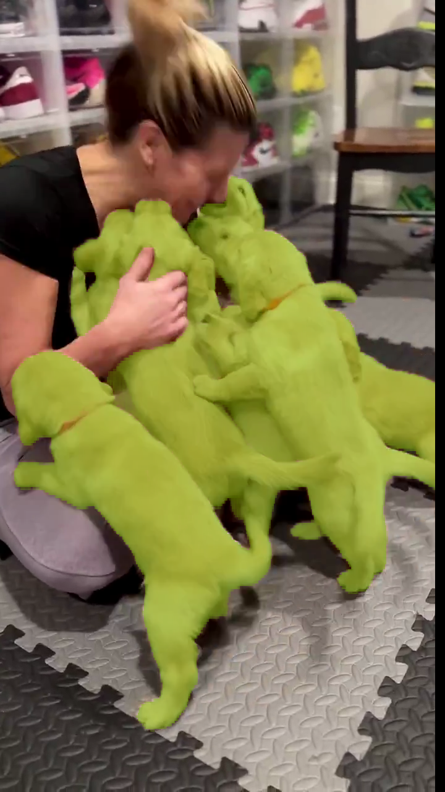
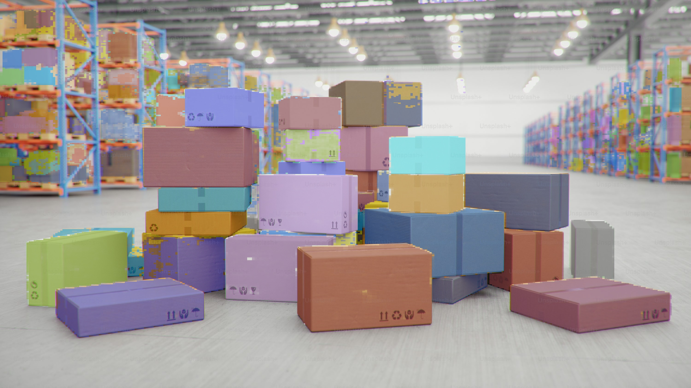

# SAM3 → TensorRT

Export Meta AI's Segment Anything 3 (SAM3) model to ONNX, then build a TensorRT engine for real-time segmentation. This repo includes a CUDA inference library and demo apps for semantic and instance segmentation.

## Table of Contents
- [Project Overview](#project-overview)
- [Benchmarks](#benchmarks)
- [Demos](#demos)
- [Repo Layout](#repo-layout)
- [Quickstart](#quickstart)
  - [On Windows](#on-windows)
- [Extensions](#extensions)
- [Troubleshooting](#troubleshooting)
- [Development guide](#development-guide)
  - [CUDA Library Notes](#cuda-library-notes)
  - [Benchmarking](#benchmarking)
  - [ONNX Export Details](#onnx-export-details)
  - [TensorRT Notes](#tensorrt-notes)
  - [License](#license)
- [Disclaimer](#disclaimer)

## Project Overview
- Python tooling to export SAM3 to a clean ONNX graph.
- TensorRT-ready workflows for building optimized engines.
- A C++/CUDA library for high-performance inference with demo apps.
- Support for Promptable concept segmentation (PCS), the latest feautre in SAM3.
- Native Windows build and runtime flow with CUDA, TensorRT, and OpenCV.
- MIT license for the love of everything nice :)

## Benchmarks
The numbers show end to end image processing latency per image (4K resolution) in ms excluding image load/save time.

| Hardware | HF+PyTorch | TensorRT+CUDA | Speedup | Notes |
| --- | --- | --- | --- | --- |
| RTX 3090 | 438 ms | 75 ms | 5.82x |  |
| A10 | 545.3 ms | 161.1 | 3.38x | GPU hits 100% utilization |
| A100 | 314.1 ms | 48.8 ms | 6.43x | 40GB SXM4 variant |
| H100 | 265.3 ms | 34.6 ms | 7.66x | PCIe variant |
| H100 | 213.2 ms | 24.9 ms | 8.56x | SXM5 variant |
| B200 | 160.0 ms | 17.7 ms | 9.03x | SXM6 variant |

Note: the HF+PyTorch path is GPU-backed too, so these numbers compare two GPU implementations rather than CPU vs GPU.

Please contribute your results and I will be happy to add them here. Use [this guide](#benchmarking) to run the benchmarks yourself.

## Demos
Video demo (click to play):
[](https://youtube.com/shorts/hHvhQ514Evs?feature=share)

Semantic segmentation produced by the C++ demo app (`prompt='dog'`)



Instance segmentation results (`prompt='box'`)



## Repo Layout
- `python/` - ONNX export and visualization scripts.
- `cpp/` - C++/CUDA library and apps (TensorRT inference).
- `demo/` - Example outputs from the C++ demo app.

## Quickstart

1) Request access to the gated model
   - Visit https://huggingface.co/facebook/sam3 and request access.
   - Ensure your `HF_TOKEN` has permission.
  - Set `HF_TOKEN` as an environment variable when running export scripts.

2) Export to ONNX
```powershell
python python/onnxexport.py
```
This produces `onnx_weights/sam3_static.onnx` plus external weight shards.

3) Build a TensorRT engine
```powershell
trtexec --onnx=onnx_weights/sam3_static.onnx --saveEngine=sam3_fp16.plan --fp16 --verbose
```

4) Build the C++/CUDA library and sample app
```powershell
cmake -S cpp -B cpp/build-win-cuda -G "Visual Studio 18 2026" -A x64 -T "cuda=C:/Program Files/NVIDIA GPU Computing Toolkit/CUDA/v13.1" -DCMAKE_CUDA_FLAGS="--allow-unsupported-compiler"
cmake --build cpp/build-win-cuda --config Release --target sam3_pcs_app
```

5) Run the demo app
```powershell
cpp/build-win-cuda/Release/sam3_pcs_app.exe <image_dir> <engine_path.engine>
```

Results are written to a `results/` folder.

### On Windows

For a tested Windows-native flow (build, prompt tests, runtime DLL handling), use:

- `WINDOWS_SAM3_PROMPT_TEST_GUIDE.md`


## Extensions
This is a very raw project and provides the crucial backend TensorRT/CUDA bits necessary for anything. From here, please feel free to fan out into any application you like. Pull requests are very welcome! Here are some ideas I can think of:
- ROS2 wrapper for real-time robotics pipelines.
- Interactive voice-based segmentation app. Have someone speak into a microphone, use a TTS model to transcribe it and feed into the engine, which then produces the segmentation mask live. I don't have the time to build it but I hope you can.
- Live camera input and overlays. You will need a beefy GPU.

## Troubleshooting
- **Access errors:** Make sure your `HF_TOKEN` has access to `facebook/sam3`.
- **ONNX export fails:** Install `transformers` from source if SAM3 is missing.
- **TensorRT parse errors:** Ensure the full `onnx_weights/` directory is copied (external data is required).
- **C++ build errors:** Confirm CUDA, TensorRT, and OpenCV are installed and discoverable through CMake variables and Windows paths.

## Development guide

### CUDA Library Notes
- The shared library target is `sam3_trt`.
- Demo app: `sam3_pcs_app` (semantic/instance visualization modes).
- Outputs include semantic segmentation and instance segmentation mask logits. If you choose `SAM3_VISUALIZATION::VIS_NONE` in your application, you need to apply sigmoid yourself.
- The library does not support building engines. Use `trtexec` instead.

### Benchmarking
Use the same image directory and prompt for all runs. Both paths time the model pipeline and exclude image load/save.

Huggingface + PyTorch:
```powershell
python python/basic_script.py <image_dir>
```

TensorRT + CUDA (benchmark mode disables output writes):
```powershell
cpp/build-win-cuda/Release/sam3_pcs_app.exe <image_dir> <engine_path.engine> 1
```

### ONNX Export Details
- Default export runs on CPU for compatibility (switch `device` to `cuda` if desired).
- SAM3 is large and exports with external weight shards; keep the entire `onnx_weights/` directory together.

### TensorRT Notes
- Use `trtexec` for quick engine builds and benchmarking.
- FP16 is the usual starting point; INT8/FP8/INT4 require calibration or compatible tooling.

### License
- MIT (see `LICENSE`).

If this saved you time, drop a ⭐ so others can find it and ship SAM-3 faster.

# Disclaimer
All views expressed here are my own. This project is not affiliated with my employer.